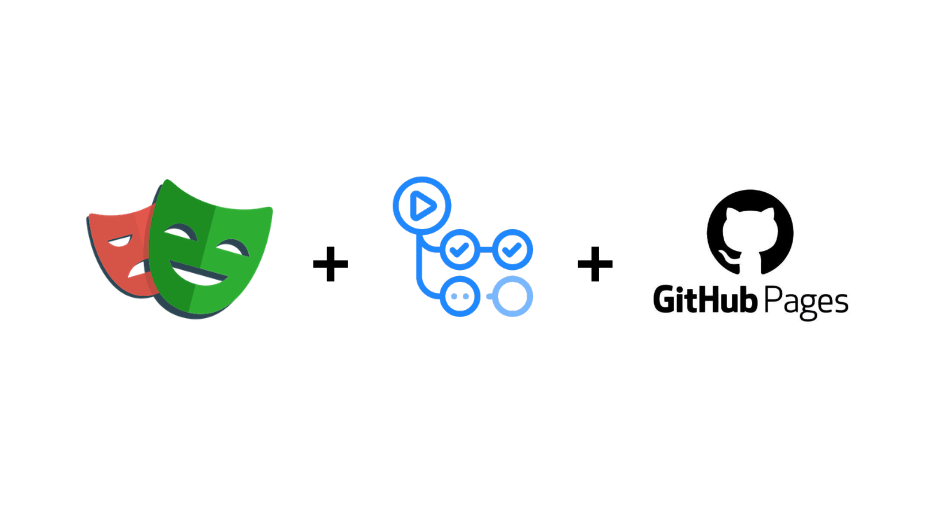
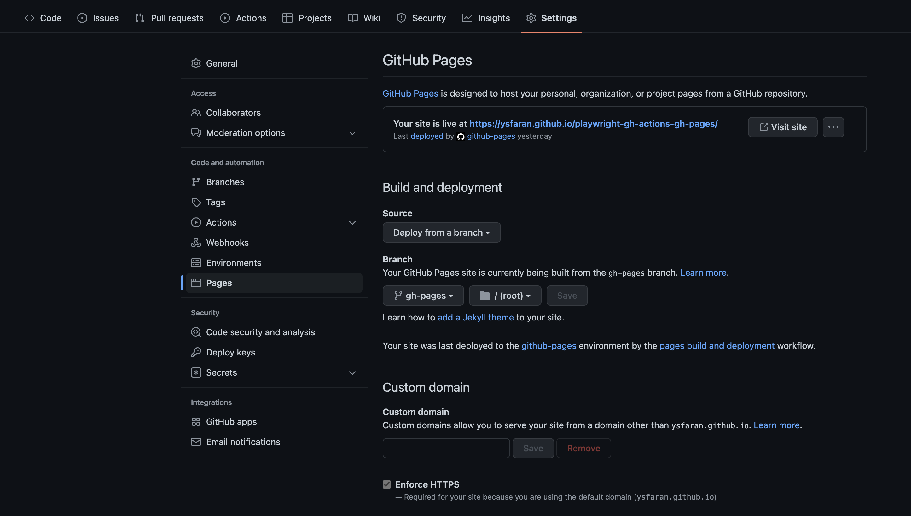
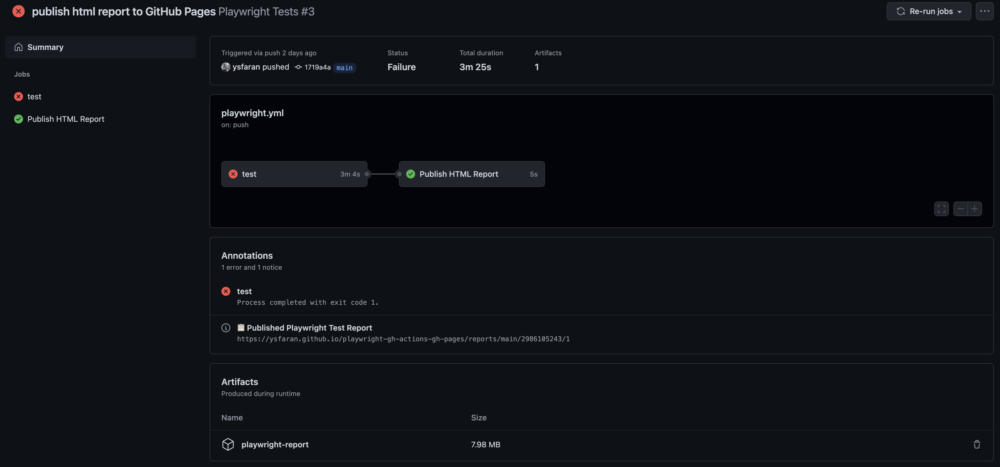
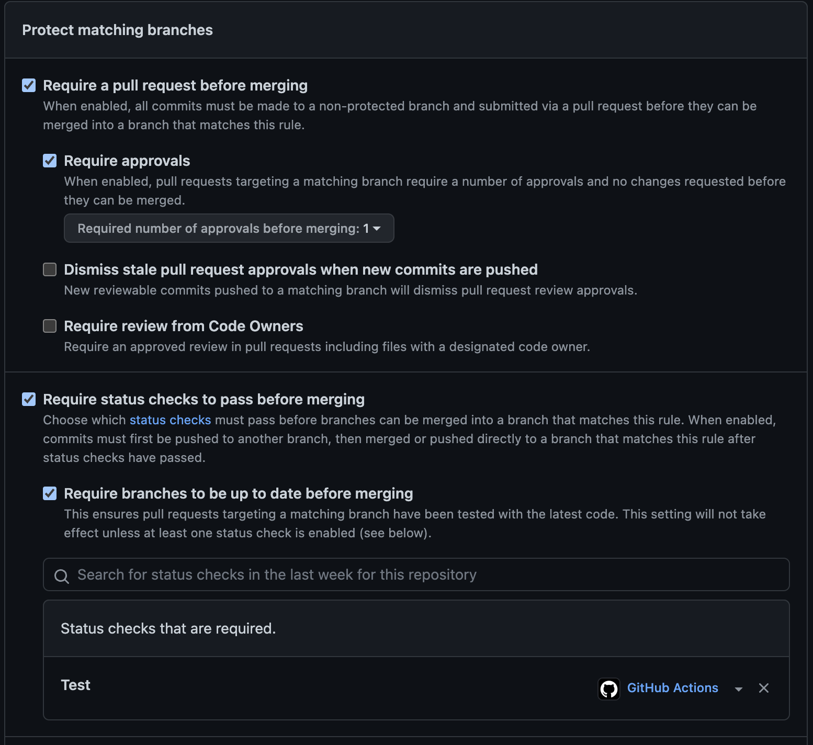

## Introduction

[Playwright](https://playwright.dev/) is a modern cross-browser testing framework developed by microsoft itself.
[GitHub Actions](https://docs.github.com/en/actions/) is the out-of-the-box solution for anything related to CI/CD pipelines on GitHub.
Last but not least [GitHub Pages](https://pages.github.com/) is a GitHub feature which allows to deploy static websites.

And all of this comes completely free for public repositories!

In this blog post I will show you how to setup a basic a Playwright project, integrate it into GitHub Actions and finally deploy an HTML report of the test results to GitHub Pages.

:::info
The complete source code can be found in this repo: [ysfaran/playwright-gh-actions-gh-pages](https://github.com/ysfaran/playwright-gh-actions-gh-pages)
:::

This post is **not** focusing on explaining all concepts of Playwright, but rather how to connect Playwright, GitHub Actions and GitHub Pages in a easy, non-cost way.

## Setup Playwright

:::tip
For an up-to-date installation guide please always refer to https://playwright.dev/docs/intro. At the point of writing this posts Playwright's latest version was `1.25.1`.
:::

Fortunately Playwright makes it really easy to setup a new project using the CLI:

```bash
yarn create playwright
```

This will start an interactive session. Make sure to at least enable GitHub Action workflow generation. Following is the configuration I used:

```bash
✔ Do you want to use TypeScript or JavaScript? · TypeScript
✔ Where to put your end-to-end tests? · tests
✔ Add a GitHub Actions workflow? (y/N) · true
```

## Generate HTML Report

One of the most important generated files is `playwright.config.ts`, so let's have a look at it:

:::info
I simplified some of the generated files. For a full list of these changes see [`aab0b9c2`](https://github.com/ysfaran/playwright-gh-actions-gh-pages/commit/aab0b9c2f83fb57a31d38af74529062b5198ca45).
:::

```ts
const config: PlaywrightTestConfig = {
  testDir: "./tests",
  // Run all tests within a file in parallel to speed up test execution
  fullyParallel: true,
  // Helpful for uncontrollable flaky tests, which are tests, occasionally failing for various reasons
  retries: 3,
  // Generates a HTML report to ./playwright-report/
  reporter: "html",
  use: {
    // Tests will be run against this page
    baseURL: "https://playwright.dev/",
    // Collect trace when retrying the failed test. See https://playwright.dev/docs/trace-viewer
    trace: "on-first-retry",
  },
  // Cross-browser testing setup
  projects: [
    {
      name: "chromium",
      use: {
        ...devices["Desktop Chrome"],
      },
    },
    {
      name: "firefox",
      use: {
        ...devices["Desktop Firefox"],
      },
    },

    {
      name: "webkit",
      use: {
        ...devices["Desktop Safari"],
      },
    },
  ],
};
```

Since the `html` reporter is already enabled by default, there are no other adaption necessary.
To get a nice HTML report covering all test result cases (`sucess`, `fail` and `flaky`) following tests have been implemented:

```ts
import { test, expect } from "@playwright/test";

test.beforeEach(({ page }) => page.goto("https://playwright.dev/"));

test("should succeed", async ({ page }) => {
  await expect(page).toHaveTitle(/Playwright/);
});

test("should fail", async ({ page }) => {
  await expect(page).not.toHaveTitle(/Playwright/);
});

test("should be flaky", async ({ page }) => {
  if (Math.random() > 0.5) {
    await expect(page).toHaveTitle(/Playwright/);
  } else {
    await expect(page).not.toHaveTitle(/Playwright/);
  }
});
```

To run the tests execute:

```bash
npx playwright test
```

After running all tests Playwright prints a summary of test restuls and publishes the HTML report to a server at a localhost address. Playwright also emits all sources for the HTML report to `playwright-report/`.

## Integrate GitHub Actions

Luckily Playwright already generated a basic `.github/workflows/playwright.yml` during [Setup Playwright](#setup-playwright) to integrate Playwright tests into a GitHub Actions worklow:

```yml
name: Playwright Tests
on:
  push:
    branches: [main, master]
jobs:
  test:
    timeout-minutes: 60
    runs-on: ubuntu-latest
    steps:
      - uses: actions/checkout@v2
      - uses: actions/setup-node@v2
        with:
          node-version: "14.x"
      - name: Install dependencies
        run: yarn
      - name: Install Playwright Browsers
        run: npx playwright install --with-deps
      - name: Run Playwright tests
        run: yarn playwright test
      - uses: actions/upload-artifact@v2
        if: always()
        with:
          name: playwright-report
          path: playwright-report/
          retention-days: 30
```

Essentially the workflow is triggered on every `push` and executes the all tests, just like you would do it locally.
It's important to note that it also uploads the Playwright HTML report as workflow artifact.
This artifact will be available to download in the `Actions` tab of your GitHub repository in each workflow run.

Please refer to the official Playwright docs on [how to download and view HTML report files](https://playwright.dev/docs/ci-intro#html-report) of a specific workflow run.

## Publish HTML Report to GitHub Pages

Being able to download, view and debug HTML reports generate by a CI/CD pipeline locally is already convenient, but there is an easier and faster way to check test results: automatically publish the HTML reports to GitHub Pages and view them directly in the browser.

Firstly a new orphan branch, which means the branch has no parent commit, for the GitHub Pages' static content needs to be created:

```bash
# Create a new branch without any commit on it
git checkout --orphan gh-pages

# Source files get autoamtically staged so remove them from git
git rm -rf .

# Optional: Check if there are really no files in the git staging area anymore
git status

# Create an initial, empty commit
git commit --allow-empty -m "setup empty branch for GitHub Pages"

# Push the branch to make it available online
git push --set-upstream origin gh-pages
```

Secondly the GitHub Pages feature needs to be enabled for your repo. Usually GitHub is enabling GitHub Pages automatically when you name a branch `gh-pages`.
If it doesn't, make sure to enable GitHub Pages manually in your repository settings:



Any change that is pushed to `gh-pages` will now automatically update the GitHub Pages website, which is publicly available at `https://<user>.github.io/<repo>/`.
Because there is no real commit on the `gh-pages` branch yet a 404 error page will be shown.

So the next logical step is to add a new job to the GitHub Actions workflow in order to push the HTML reports to `gh-pages` branch:

```yml
publish_report:
  name: Publish HTML Report
  # using always() is not ideal here, because it would also run if the workflow was cancelled
  if: "success() || needs.test.result == 'failure'"
  needs: [test]
  runs-on: ubuntu-latest
  continue-on-error: true
  env:
    # Unique URL path for each workflow run attempt
    HTML_REPORT_URL_PATH: reports/${{ github.ref_name }}/${{ github.run_id }}/${{ github.run_attempt }}
  steps:
    - name: Checkout GitHub Pages Branch
      uses: actions/checkout@v2
      with:
        ref: gh-pages
    - name: Set Git User
      # see: https://github.com/actions/checkout/issues/13#issuecomment-724415212
      run: |
        git config --global user.name "github-actions[bot]"
        git config --global user.email "41898282+github-actions[bot]@users.noreply.github.com"
    - name: Download zipped HTML report
      uses: actions/download-artifact@v2
      with:
        name: playwright-report
        path: ${{ env.HTML_REPORT_URL_PATH }}
    - name: Push HTML Report
      timeout-minutes: 3
      # commit report, then try push-rebase-loop until it's able to merge the HTML report to the gh-pages branch
      # this is necessary when this job is running at least twice at the same time (e.g. through two pushes at the same time)
      run: |
        git add .
        git commit -m "workflow: add HTML report for run-id ${{ github.run_id }} (attempt:  ${{ github.run_attempt }})"

        while true; do
          git pull --rebase
          if [ $? -ne 0 ]; then
            echo "Failed to rebase. Please review manually."
            exit 1
          fi

          git push
          if [ $? -eq 0 ]; then
            echo "Successfully pushed HTML report to repo."
            exit 0
          fi
        done
    - name: Output Report URL as Worfklow Annotation
      run: |
        FULL_HTML_REPORT_URL=https://ysfaran.github.io/playwright-gh-actions-gh-pages/$HTML_REPORT_URL_PATH

        echo "::notice title=📋 Published Playwright Test Report::$FULL_HTML_REPORT_URL"
```

Basically this job commits the HTML report files to the `gh-pages` branch, which will then automatically redploy the website.

It does so by specifying a new unique path for each test result:

```yml
HTML_REPORT_URL_PATH: reports/${{ github.ref_name }}/${{ github.run_id }}/${{ github.run_attempt }}
```

The job then tries to push these changes and rebases if necessary until a push was succssful.
Rebasing is safe here, because - as already mentioned - each workflow run gets its own uniquie path, so there can't be any file conflicts ever.

Last but not least the publicly available URL is printed as GitHub Worfklow Annotation:

:::tip
It might take some while for GitHub Pages to update its content after a new push, so the printed URL will point to a 404 page initially.
In the `Actions` tab of your repo you can check `pages-build-deployment` workflow runs, which is automatically triggered for GitHub Pages, to see if the GitHub Pages deployment was successful.
:::



## Add Multi-Branch Support

Only in rare cases you work on a single branch. Also the pipeline is currently not integrated in any pull request process, meaning that there are no restriction to push or even force push to your `main`/`master`.
Its time to change that!

First of all we need to enable branch protections rules for the default branch:

1. Go to the settings of your repo
2. Select `Branches` under `Code and automation` in the menu
3. Hit the `Add branch protection rule` button
4. Add your default branchs name for `Branch name pattern`
5. Configure your branch protecting rules as desired, most importantly being:



Note that I only put `Test` under `Status checks that are required.` because you should still be allowed to merge to `main` branch if some HTML report couldn't be published.
A green `Test` job for a branch represents a valid state anyway in this case.

Secondly the workflow needs to be adapted:

```diff
on:
  push:
-    branches: [ main, master ]
-  pull_request:
-    branches: [ main, master ]
+    branches-ignore: [ main, gh-pages ]
```

So the workflow is triggered after each push on every branch except `main` and `gh-pages`.
I purposely removed `pull_request` here, because it's really hard (at this point in time) to make `push` and `pull_requests` work together with GitHub Actions.
Feel free to check my answer on [StackOverflow answer](https://stackoverflow.com/a/71158335/6489012) regarding this topic.

:::caution
If you want to work with `pull_request` every occurence of `${{ github.ref_name }}` should be replaces with `${{ github.head_ref || github.ref_name }}`.
Check the related StackOverflow answer for details: https://stackoverflow.com/a/71158878/6489012.
:::

I also highly recommend to enable [concurrency groups](https://docs.github.com/en/actions/using-workflows/workflow-syntax-for-github-actions#concurrency) in your workflow file to make sure only one workflow is running at the same time for each branch:

```yaml
concurrency:
  group: ${{ github.ref_name }}
  # optional
  cancel-in-progress: true
```

## Delete Reports from GitHub Pages

After a branch was successfully merged it makes sense to delete all corresponding HTML reports from GitHub Pages. This requires the implementation of a new workflow file:

```yaml
name: Delete

on:
  delete:
    branches-ignore: [main, gh-pages]

# ensures that currently running Playwright workflow of deleted branch gets cancelled
concurrency:
  group: ${{ github.event.ref }}
  cancel-in-progress: true

jobs:
  delete_reports:
    name: Delete Reports
    runs-on: ubuntu-latest
    env:
      # Contains all reports for deleted branch
      BRANCH_REPORTS_DIR: reports/${{ github.event.ref }}
    steps:
      - name: Checkout GitHub Pages Branch
        uses: actions/checkout@v2
        with:
          ref: gh-pages
      - name: Set Git User
        # see: https://github.com/actions/checkout/issues/13#issuecomment-724415212
        run: |
          git config --global user.name "github-actions[bot]"
          git config --global user.email "41898282+github-actions[bot]@users.noreply.github.com"
      - name: Check for workflow reports
        run: |
          if [ -z "$(ls -A $BRANCH_REPORTS_DIR)" ]; then
            echo "BRANCH_REPORTS_EXIST="false"" >> $GITHUB_ENV
          else
            echo "BRANCH_REPORTS_EXIST="true"" >> $GITHUB_ENV
          fi
      - name: Delete reports from repo for branch
        if: ${{ env.BRANCH_REPORTS_EXIST == 'true' }}
        timeout-minutes: 3
        run: |
          cd $BRANCH_REPORTS_DIR/..

          rm -rf ${{ github.event.ref }}
          git add .
          git commit -m "workflow: remove all reports for branch ${{ github.event.ref }}"

          while true; do
            git pull --rebase
            if [ $? -ne 0 ]; then
              echo "Failed to rebase. Please review manually."
              exit 1
            fi

            git push
            if [ $? -eq 0 ]; then
              echo "Successfully pushed HTML reports to repo."
              exit 0
            fi
          done
```

The job of this workflow is pretty similiar to the one publishing the HTML report. This time it's just the other way around: `gh-pages` branch is checked out and the folder `reports/<branch-name>` is deleted.
Then the same push-rebase loop is initated to trigger a GitHub Pages deployment.

Important to note here is the following part:

:::info
This time the name of the (deleted) branch is neither retreived by `github.head_ref` and `github.ref_name`, but `github.event.ref`.
In case the workflow was triggered by a `delete` the value of `github.ref_name` will be the one of the default branch, here `main`.
:::

```yaml
concurrency:
  group: ${{ github.event.ref }}
  cancel-in-progress: true
```

This statement makes sure that any running workflow within the same concurrency group will be cancelled.
In our case this means if tests for a deleted branch are still running, they will be cancelled.

## Conclusion

We created a Playwright project from scratch, integrated tests in GitHub Actions, deployed test results to GitHub Pages and finally established branch protections rules with a simple but important pull request strategy.
All of this, without any costs.

All in all it's all about automation and process optimization. Keeping a team busy with daunting manual tasks can decrease effincy and motivation quite a bit.
This can go from manual deployment plans to smaller aspects like hard to debug test results. In the long run saving some minutes of daily, manual work can have a huge impact.

Questions and feedback are always welcome. 🙂
